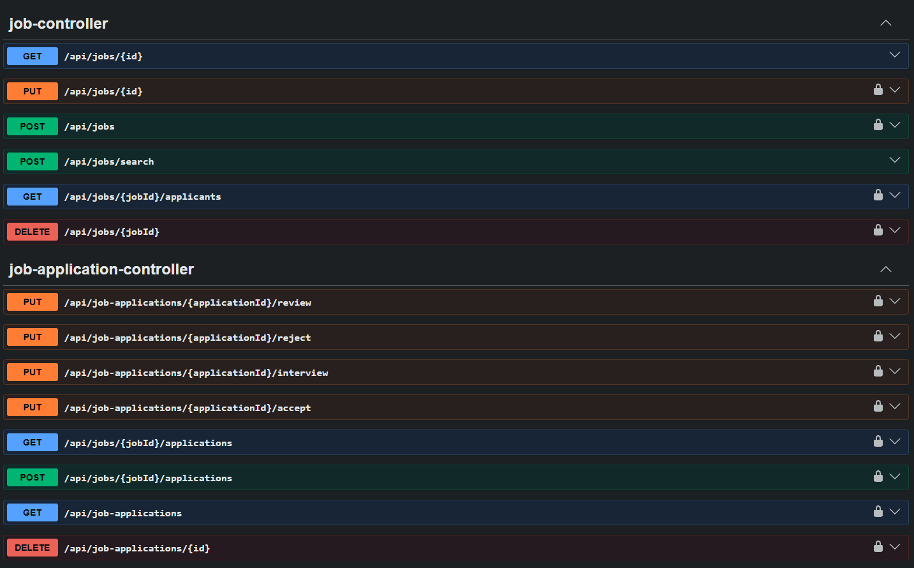
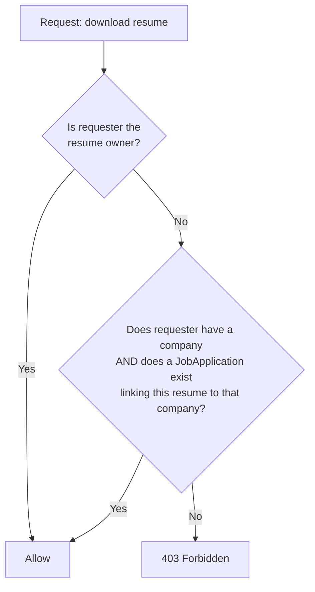
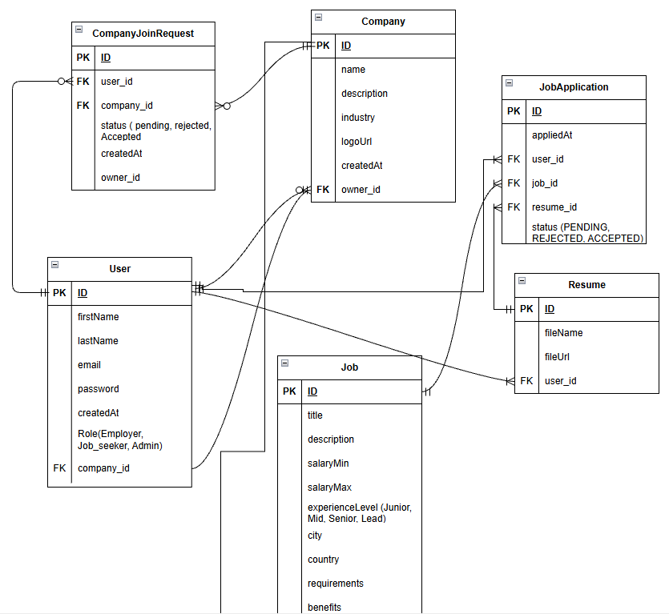
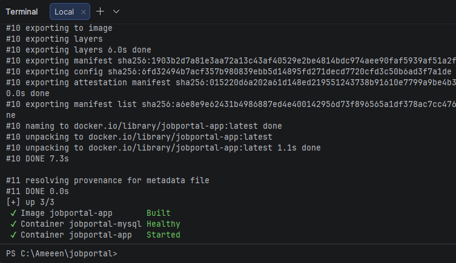

# Job Portal API
 
A REST API for a job portal built with Java and Spring Boot, modeling a two-sided hiring platform: job seekers apply to jobs with reusable resumes, and employers operate through companies with a distinct **ownership vs. staff membership** structure.
 
**Key technical decisions at a glance:**
- Two-tier company authorization (**owner** vs. **staff**), enforced in the service layer, not just role checks
- A resume access model with **two valid paths** - owner, or company staff reviewing a real application - verified via a derived JPA query
- A **status state machine** for applications (`PENDING → REVIEWED → INTERVIEW → ACCEPTED`) that rejects out-of-order transitions
- Dual response DTOs generated from the same entity, shaped differently for job seekers vs. company staff
  
## Quick Start

```bash
cp .env.example .env && docker-compose up
```
Then open **Swagger UI**: [http://localhost:8080/swagger-ui/index.html](http://localhost:8080/swagger-ui/index.html)



## Tech Stack

| Category | Technology |
|---|---|
| Language / Runtime | Java 21 |
| Framework | Spring Boot |
| Security | Spring Security, JWT (`jjwt`) |
| Persistence | Spring Data JPA / Hibernate |
| Database | MySQL 8 |
| Object Mapping | MapStruct |
| Validation | Jakarta Bean Validation |
| API Documentation | springdoc-openapi (Swagger UI) |
| Testing | JUnit 5, Mockito, AssertJ |
| Containerization | Docker, Docker Compose |
| Build Tool | Maven |

## Features

- JWT-based authentication with role-based and ownership-based authorization
- Three user roles: `ADMIN`, `EMPLOYER`, `JOB_SEEKER`
- Company creation, ownership, and a staff join-request approval workflow
- Job posting, editing, deletion, and dynamic search/filter/sort/pagination
- A full job application lifecycle with an enforced status state machine: `PENDING → REVIEWED → INTERVIEW → ACCEPTED`, with rejection and withdrawal handled separately
- Resume upload/download/delete as a reusable "resume library" per user, referenced (not re-uploaded) on each application
- Centralized exception handling with consistent JSON error responses
- OpenAPI/Swagger documentation with bearer-token authorization support
- Dockerized application and MySQL database via Docker Compose

## Architecture

The application follows a layered architecture:

```
Controller → Service → Repository → Database
```

- **Controllers** handle HTTP concerns only - request mapping, `@PreAuthorize` role gates, and delegating to services. No business logic lives here.
- **Services** contain all business rules and authorization checks (ownership, staff membership, state transitions).
- **Repositories** are Spring Data JPA interfaces, including derived query methods and JPA `Specification`-based dynamic filtering for job search.
- **DTOs and MapStruct mappers** separate the persistence model from what's exposed over the API. Notably, job applications have **two distinct response DTOs** - one shaped for the applying job seeker (`JobApplicationSeekerResponse`) and one shaped for reviewing company staff (`JobApplicationCompanyResponse`) - generated from the same entity via two separate mapper methods, keeping view-shaping in the mapper and authorization in the service.
- **File storage** is abstracted behind a `FileStorageService`, decoupling resume upload/download logic from where files physically live (currently local filesystem, mounted as a Docker volume).

## Roles & Authorization

| Role | Capabilities |
|---|---|
| `JOB_SEEKER` | Search/apply to jobs, manage own resumes, track own applications, withdraw applications |
| `EMPLOYER` | Create or request to join a company; once affiliated, post/edit/delete jobs and review applicants for their company |
| `ADMIN` | Elevated permissions on job deletion |

Authorization in this project goes beyond role checks - it's built on two additional, deliberately separated concepts:

- **Company ownership vs. staff membership.** A `Company` has exactly one `owner` (the user who created it). Other employers can request to join as staff via a `CompanyJoinRequest`, approved or rejected only by the owner. Once approved, staff can post jobs and review applicants - but only the **owner** can approve/reject join requests, update, or delete the company itself. This distinction is enforced in the service layer, not inferred from role alone.
- **Resume access is dual-path.** A resume's owner can always access it. Company staff can access an applicant's resume **only** if that resume is actually attached to an application submitted to their company - verified via a derived repository query (`existsByResumeIdAndJob_Company_Id`) rather than a broader role check.

Unauthorized access attempts are rejected with `403 Forbidden`; both custom `ForbiddenException`s and Spring Security's own `AccessDeniedException` (thrown by `@PreAuthorize` failures) are normalized to the same JSON error shape.

**Dual-path resume authorization:**



## Business Logic

Selected non-trivial rules enforced in the service layer:

- **Company creation vs. joining are different flows.** Creating a company immediately makes the creator its owner. Joining an existing company requires a pending `CompanyJoinRequest` and explicit owner approval - it does not mutate `user.company` until approved.
- **A user can't create a company while already affiliated with one**, and can't create a company whose name already exists.
- **Company deletion cascades deliberately**, not accidentally: existing jobs, their applications, and any pending join requests for the company are cleaned up before the company row is deleted, avoiding foreign-key failures and orphaned data.
- **Job application approval is a status change only.** Accepting or rejecting an application updates `ApplicationStatus`; it never touches `user.company`. This is a deliberate distinction from `CompanyJoinRequest` approval, which does mutate `user.company` - two structurally similar approval flows with intentionally different side effects.
- **Application status transitions are order-enforced**, not freely settable: an application can only move to `INTERVIEW` from `REVIEWED`, and to `ACCEPTED` from `INTERVIEW` - skipping steps is rejected with a `409 Conflict`.
- **Duplicate applications are prevented at two layers**: a service-level check before insert, and a database-level unique constraint (`user_id`, `job_id`) as a defense-in-depth backstop.
- **Resumes are a reusable library, not a per-application upload.** A `JobApplication` references an existing `Resume` by ID; uploading and applying are separate actions, and a resume upload can be reused across multiple applications.
- **Resume ownership is validated at apply time** - a job seeker cannot submit an application using a resume that isn't theirs.

## Application Workflow

```
Job seeker uploads resume(s)  →  resume library
        ↓
Job seeker applies to a job (references an existing resumeId)
        ↓
JobApplication created, status = PENDING
        ↓
Company staff reviews  →  PENDING → REVIEWED
        ↓
Company staff schedules interview  →  REVIEWED → INTERVIEW
        ↓
Company staff makes a decision  →  INTERVIEW → ACCEPTED
                                  (or → REJECTED, from most non-terminal states)
        ↓
Job seeker can withdraw at any point prior to a terminal decision
```

## Database / Domain Model



Core entities and relationships:

- **User** - has a `Role` (`ADMIN` / `EMPLOYER` / `JOB_SEEKER`) and an optional `Company` affiliation.
- **Company** - has one `owner` (`User`) and any number of affiliated staff `User`s.
- **CompanyJoinRequest** - links a `User` to a `Company` with a `JoinRequestStatus` (`PENDING` / `APPROVED` / `REJECTED`). Kept as its own entity rather than a field on `User`, since a user can accumulate multiple requests over time.
- **Job** - belongs to a `Company`; carries structured filterable attributes (`ExperienceLevel`, `WorkType`, `EmploymentType`, salary range, location, status).
- **Resume** - belongs to a `User`; stores original filename and a storage key, independent of any specific application.
- **JobApplication** - links a `User`, a `Job`, and a `Resume`, with an `ApplicationStatus`. Enforces a unique constraint on (`user_id`, `job_id`) to prevent duplicate applications at the database level.

## API Overview

**Authentication**
- `POST /api/register` - register a new user with a role
- `POST /api/login` - authenticate and receive a JWT

**Companies**
- `GET /api/companies`, `GET /api/companies/{id}`, `GET /api/companies/{id}/jobs`
- `POST /api/companies`, `PUT /api/companies/{id}`, `DELETE /api/companies/{id}`

**Join Requests**
- `POST /api/companies/{companyId}/join`
- `GET /api/companies/{companyId}/join-requests` *(owner only)*
- `PUT /api/companies/{companyId}/join-requests/{requestId}/approve` *(owner only)*
- `PUT /api/companies/{companyId}/join-requests/{requestId}/reject` *(owner only)*

**Jobs**
- `GET /api/jobs/{id}`, `POST /api/jobs/search` (filterable, paginated, sortable)
- `POST /api/jobs`, `PUT /api/jobs/{id}`, `DELETE /api/jobs/{jobId}`

**Applications**
- `POST /api/jobs/{jobId}/applications` - apply to a job
- `GET /api/job-applications` - current user's own applications
- `GET /api/jobs/{jobId}/applications` - applicants for a job *(company staff)*
- `PUT /api/job-applications/{applicationId}/review|interview|accept|reject`
- `DELETE /api/job-applications/{id}` - withdraw

**Resumes**
- `GET /api/resumes`, `POST /api/resumes`
- `GET /api/resumes/{id}/download`, `DELETE /api/resumes/{id}`

Full request/response schemas are available via Swagger UI (see below) rather than duplicated here.

## Authentication

Authentication is stateless and JWT-based:

1. `POST /api/register` creates a user with a BCrypt-hashed password and a chosen role.
2. `POST /api/login` authenticates credentials via Spring Security's `AuthenticationManager` and issues a signed JWT.
3. Protected endpoints require `Authorization: Bearer <token>`, validated by a custom filter backed by a `UserDetailsService` implementation.
4. Method-level authorization uses `@PreAuthorize` for role gates (e.g. `hasRole('EMPLOYER')`), layered with service-level ownership/membership checks that role annotations alone can't express (e.g. "staff of *this specific* company").

## Testing

Unit tests are written with **JUnit 5, Mockito, and AssertJ**, using `@ExtendWith(MockitoExtension.class)` with mocked repositories/mappers to isolate service-layer logic.

Current coverage: **`CompanyServiceImpl`, `JobServiceImpl`, and `ResumeServiceImpl`**, including both success paths and business-rule violations - for example:
- Ownership and staff-membership authorization failures (`cannotUpdateCompanyWhenNotOwner`, `employerCannotDeleteOtherCompanyJob`)
- Cascading delete behavior (`deleteCompanyWithJobsSuccessfully` verifies jobs, applications, and join requests are cleaned up together)
- File-storage rollback on failure (`uploadDeletesFileWhenSomethingFails` verifies an orphaned file is deleted if the database save fails after upload)
- Not-found and cross-user access scenarios for resumes and jobs

Additional service and controller-level tests are actively in progress.

## Docker

The application ships with a `Dockerfile` and `docker-compose.yml` defining two services:

- **`mysql`** - MySQL 8, with a healthcheck (`mysqladmin ping`) gating application startup so the app doesn't attempt to connect before the database is ready
- **`app`** - the Spring Boot application, built from the local `Dockerfile`, depending on MySQL's healthy state

Both use named volumes (`mysql_data`, `app_storage`) so database contents and uploaded resumes persist across container restarts.

**To run:**
```bash
cp .env.example .env   # fill in real values
docker-compose up
```
The API will be available at `http://localhost:8080`.



## Swagger / API Documentation

Interactive API documentation is available once the application is running:

- Swagger UI: `http://localhost:8080/swagger-ui/index.html`
- Raw OpenAPI spec: `http://localhost:8080/v3/api-docs`

Protected endpoints are documented with bearer-token security requirements - use the **Authorize** button in Swagger UI with a token obtained from `POST /api/login` to call protected endpoints directly from the docs.

## Configuration

Configuration is externalized via environment variables (see `.env.example`):

| Variable | Purpose |
|---|---|
| `MYSQL_DATABASE` | Database name |
| `MYSQL_ROOT_PASSWORD` | MySQL root password |
| `MYSQL_USER` / `MYSQL_PASSWORD` | Application database credentials |
| `JWT_SECRET` | Secret key used to sign JWTs |

Additional application-level configuration (multipart upload limits, file storage location, JPA settings) lives in `application.properties`.

## Running Locally

Docker Compose (see Quick Start above) is the recommended path. To run without Docker:

1. Have a MySQL instance running locally.
2. Set the required environment variables (or edit `application.properties` directly).
3. `mvn spring-boot:run`

## Future Improvements

Deliberately out of scope for this iteration, to keep focus on core business logic and authorization design:
- Scheduled expiration of jobs past their `expiresAt` date (straightforward addition via Spring's `@Scheduled`)
- Email notifications on application status change (via Spring Mail)
- Extended test coverage for `JoinRequestService`, `JobApplicationService`, and controller/integration-level tests
- Refresh token support

A frontend client (React) is planned as a separate project, consuming this API directly - the DTOs and endpoint structure above are designed with that integration in mind.
